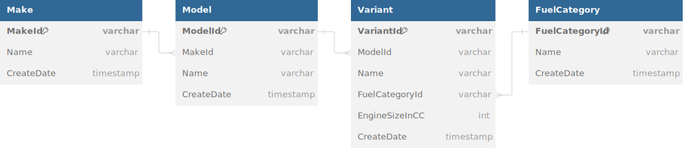
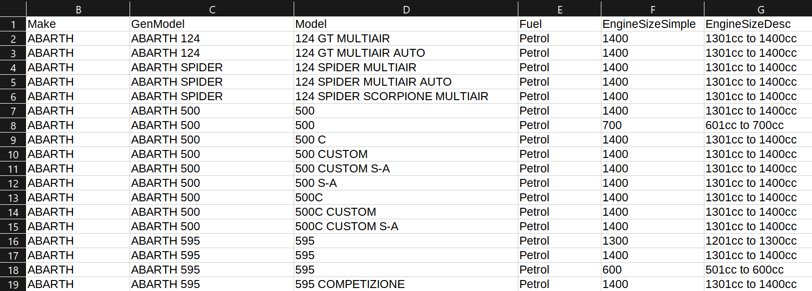
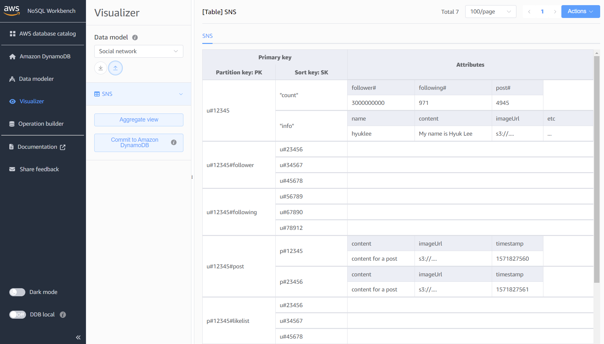
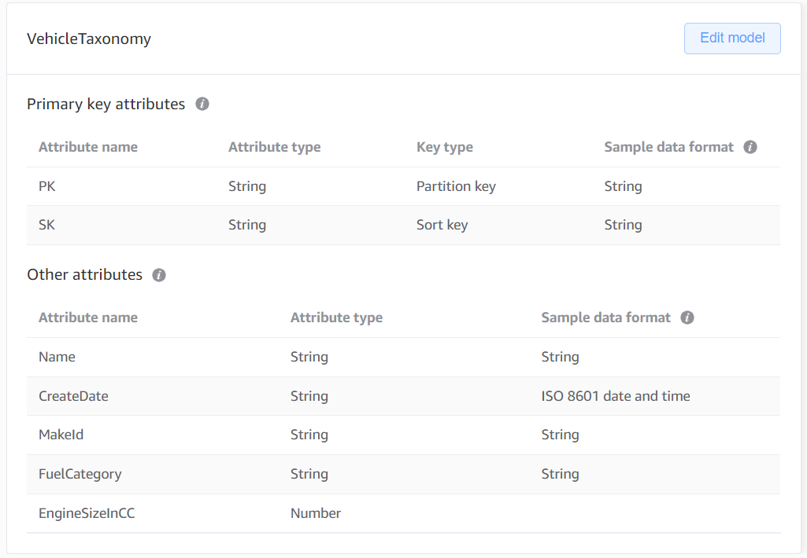
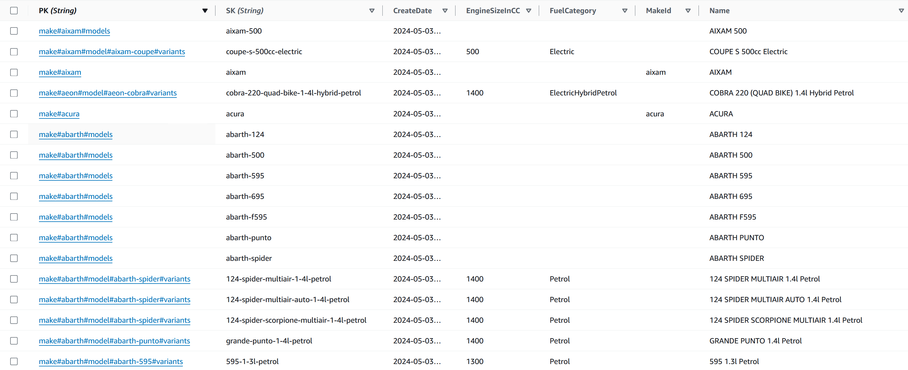
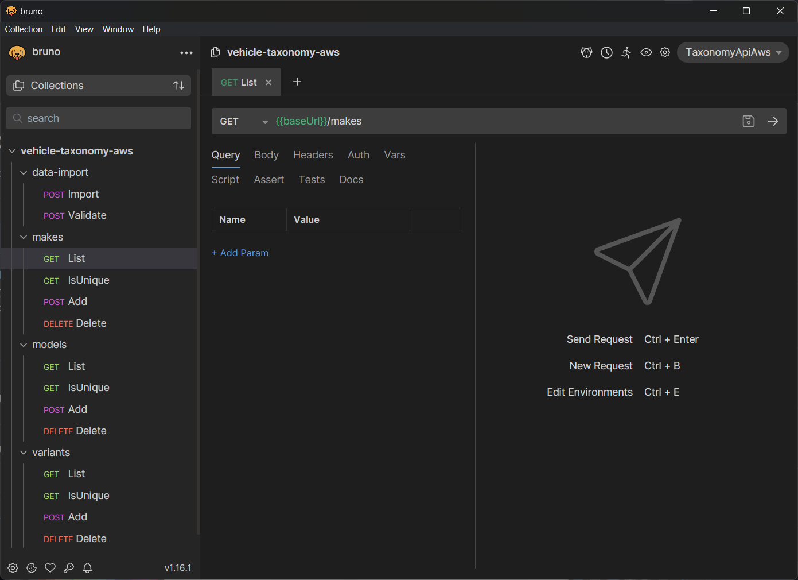

# VehicleTaxonomy.Aws

An example of a microservice that can be used to classify vehicles by make, model and variant. I have used this microservice to explore the AWS serverless stack, specifically:

- Lambda (.NET 8)
- DynamoDb
- SAM (Serverless Application Model)

This example is also available in the following stacks:

- [Azure Serverless (Functions, CosmosDb, Bicep)](https://github.com/HeyJoel/VehicleTaxonomy.Azure) 

## Contents

- [Design Overview](#design-overview)
- [Local Development](#local-development)
- [Deployment](#deployment)
- [API Docs](#api-docs)

## Design Overview

### Domain Model

The taxonomy API will use a simplified hierarchy of classifications and only covers a single vehicle type (cars):

- **Make:** AKA Brand or Marque. The retail name of the company that produces a range of vehicle models. Note that a parent company may own a range of makes e.g. "Volkswagen", "Audi" and "Porche" are all makes owned by the "Volkswagen Group" organisation.
- **Model:** A model of vehicle often with a distinct shape and chassis e.g. for make "Volkswagen" modles could be "Polo", "ID.3", "Golf Plus" etc. A Make has many models, and a model can have many configurations or "variants".
- **Variant:** AKA derivative or configuration. A specific configuration of a vehicle model combining attributes such as the "trim" level, fuel type and engine size e.g. Volkswagen Polo variants include "POLO MATCH TDI 1.5l Diesel", "POLO S 1.2l Petrol" and "POLO S 75 AUTO 1.4l Petrol".

In addition we'll also capture some example attributes against a variant including the fuel type and engine size. This structure can be represented by the entity relationship diagram (ERD) below:



### API Design

The microservice will need to cover the following behavior for each of the three entities in the make-model-variant hierarchy:

- List all, by parent entity id if applicable
- Determine if a new entity meets uniqueness criteria i.e. an "is unique" query
- Add entity
- Delete entity

Additionally we'll need a way to bulk import taxonomy data via a CSV file.

### Import Data

As example data we'll be using [vehicle statistics data from the UK Government](https://www.gov.uk/government/collections/vehicles-statistics), available under the [open government licence v3](https://www.nationalarchives.gov.uk/doc/open-government-licence/version/3/). Here's an extract of the data:



An export of the data from 2024 can be found in the data directory at [/data/MakesModelsFuelType.csv](/data/MakesModelsFuelType.csv), which is around 6mb and has around 75,000 rows. Once imported the dataset would be expected to only grow slowly over time as new makes and models enter production. It is not expected that older data will need to be updated often or at all.

This data does not explicitly include a variant or derivative so we will need to construct one from the "Model", "Fuel" and "EngineSizeSimple" columns in the CSV. Confusingly, it will be the CSV "GenModel" value (AKA "Generation" Model) that we will use for our interpretation of a vehicle "Model", as this value best aligns with a customer expectations when, for example, filtering vehicle selection by model.

The dataset also include data for non-car vehicle types, but including this data is a non-goal. 


### Database Design: DynamoDb

> DynamoDb isn't necessarily the right choice for a small sized relational dataset such as this, especially given the limitations DynamoDb imposes on querying data. However it is an interesting exercise that pushes beyond simpler key-value storage examples.

When designing a DynamoDb table to fit our domain model it's important to consider [how to design partition keys](https://docs.aws.amazon.com/amazondynamodb/latest/developerguide/bp-partition-key-uniform-load.html) and understand how to [translate relational data to a single-table design](https://aws.amazon.com/blogs/compute/creating-a-single-table-design-with-amazon-dynamodb/). The [AWS NoSQL Workbench](https://aws.amazon.com/dynamodb/nosql-workbench/) is also a useful tool in designing a table schema, making it easy to visualize sample data models datasets, such as the "Social network" example shown below:



#### Vehicle Taxonomy Schema

For our vehicle taxonomy data we'll use a single-table design, overloading the table to store all our entity types:



Here's a description of the data fields:

- **PK:** The Partition Key composition depends on the entity e.g. for a make the format will be "make#\{MakeId\}", for a model "make#\{MakeId\}#models" or for variants "model#\{ModelId\}#variants". This allows querying by PK to list makes and models while retaining good cardinality.
- **SK:** The sort key is always the entity id e.g. for make "volkswagen" for model "volkswagen-polo" for variant "volkswagen-polo-polo-sport-1-3-petrol". This allows the PK and SK to form a unique combination, allowing us to look up an individual record.
- **Name:** Publicly displayable name or title of the record e.g. "BMW" or "3 Series".
- **MakeId:** For Makes only. A copy of the make id (also stored in SK), but only present for makes allowing for a sparse GSI that can be used to query all makes.
- **FuelCategory:** Variant only. The type of fuel the vehicle uses. This string value maps to a FuelCategory enum in the domain.
- **EngineSizeInCC:** Variant only. The size of the engine in Cubic Centimetres (CC) e.g. 125, 600, 3800. 
- **CreateDate:** The date the record was created in UTC.

So, the `PK` and `SK` key combination will be used to access each record individually. We can also to use the `PK` by itself to retrieve lists of models and variants by their parent identifier. Unfortunately we cannot list all makes through this index without performing an expensive [scan operation](https://docs.aws.amazon.com/amazondynamodb/latest/developerguide/bp-query-scan.html) on all records in the table, so instead we enable this query via a "sparse" [Global Secondary Index (GSI)](https://docs.aws.amazon.com/amazondynamodb/latest/developerguide/GSI.html) on `MakeId`.

Here's what the table data looks like:



### API Endpoints: Lambda

There are several different approaches .NET lambda development:

- [ASP.NET Application](https://docs.aws.amazon.com/lambda/latest/dg/csharp-package-asp.html): Build APIs on top of the ASP.NET stack; familiar and flexible but heavy weight and not optimized for lambda execution.
- [Class library](https://docs.aws.amazon.com/lambda/latest/dg/csharp-handler.html): Build APIs as a .NET class library on top of the .NET Lambda runtime.
- [Executable Assembly](https://docs.aws.amazon.com/lambda/latest/dg/csharp-handler.html): Similar to the class library approach, but building on top of the top-level statement feature intoduced in .NET 6 to allow for a single-file function definition.
- [Lambda Annotations Framework](https://github.com/aws/aws-lambda-dotnet/blob/master/Libraries/src/Amazon.Lambda.Annotations/README.md): Makes .NET Lambda runtime development more familiar to ASP.NET developers, simplifying DI and using attributes to annotate lambda endpoints. Annotations are used to automatically generate CloudFormation templates. 

This project uses the Lambda Annotations Framework as it's a bit simpler to work with than using the .NET Lambda runtime directly, and it makes it easier to bind multiple functions in the same project. The .NET lambda framework also now supports AOT to improve cold startup times, however this is currently disabled in the project, see [issue #1 for more details](https://github.com/HeyJoel/VehicleTaxonomy.Aws/issues/1).

### Infrastructure as Code (IaC): SAM

There are a number of IaC frameworks for getting our lambda infrastructure deployed:

- [CloudFormation](https://docs.aws.amazon.com/AWSCloudFormation/latest/UserGuide/Welcome.html): Base-level framework for defining and provisioning AWS resources through JSON or YAML templates, organized into "stacks".
- [SAM (Serverless Application Model)](https://docs.aws.amazon.com/serverless-application-model/latest/developerguide/what-is-sam.html): Builds on top of CloudFormation templates, making them easier to work with and less verbose for "serverless" resources such as lambdas and DynamoDb. Includes CLI tools for local testing and deploying.
- [CDK (Cloud Development Kit)](https://docs.aws.amazon.com/cdk/v2/guide/home.html): AWS IaC using programming languages such as TypeScript and C#. Resources are ultimately provisioned through CloudFormation.
- [Terraform](https://www.terraform.io/): Popular cross-platform IaC via configuration files (HCL). [OpenTofu](https://opentofu.org/) is an open source fork of Terraform.
- [Pulumi](https://www.pulumi.com/): Open source cross platform IaC using programming languages such as TypeScript and C#.

All are viable options but for this project we'll use SAM as we're only managing AWS serverless resources and for learning purposes it's a nice middle ground between raw CloudFormation templates and the higher level abstraction frameworks.

## Local Development

### Prerequisits

- .NET 8 SDK
- Docker environment e.g. [Docker Desktop](https://qubitpi.github.io/docker-docs/get-docker/).

Tested on Visual Studio 2022 and Docker Desktop for Windows with WSL2, but other environments should be supported.

### Running the API

Currently the API project cannot be run locally because the AWS .NET Lambda runtime does not support a local host environment, and the AWS SAM "local" tool does not work out the box with DynamoDb local. [Issue #2](https://github.com/HeyJoel/VehicleTaxonomy.Aws/issues/2) covers improvements in this area.

### Running Tests

The test projects cover the majority of the solution, however due to a lack of a local lambda runtime host the tests cannot cover the serialization and gateway bindings of the lambda functions. Many of the domain project tests run integrated with a local DynamoDb instance provided via [test containers](https://dotnet.testcontainers.org/). As long as you have a local docker runtime running you will be able to run the tests.

## Deployment

### Prerequisits

- [AWS CLI and a configured AWS account](https://docs.aws.amazon.com/serverless-application-model/latest/developerguide/prerequisites.html)
- [SAM CLI](https://docs.aws.amazon.com/serverless-application-model/latest/developerguide/install-sam-cli.html)

### SAM Deployment

Infrastructure provisioning and deployments are managed through [AWS SAM](https://docs.aws.amazon.com/serverless-application-model/latest/developerguide/what-is-sam.html) and the `template.yaml` file in the root of the solution. 

#### To build the project:

From a console prompt use the SAM CLI:

```
sam build
```

I've found the build process to be a bit flakey and occasionally fails when accessing the template.yaml file, particularly if I've had it open in VS but not always. 

#### To deploy to AWS:

From a console prompt use the SAM CLI:

```
sam deploy
```

#### To delete the stack from AWS:

From a console prompt use the SAM CLI:

```
sam delete
```

Note that AWS SAM does not delete the CloudWatch log groups or set a default retention period so you'll need to delete those manually. [Issue #3 covers setting a default retention period.](https://github.com/HeyJoel/VehicleTaxonomy.Aws/issues/3) 

## API Docs

> [Bruno](https://www.usebruno.com/) is an open source API client similar to postman, but does not require a login and saves API collections to your file system.

A [Bruno](https://www.usebruno.com/) API collection is available in the [/docs/api](/docs/api) folder, all you need to do is add a `baseUrl` environment variable for your lambda deployment. 

